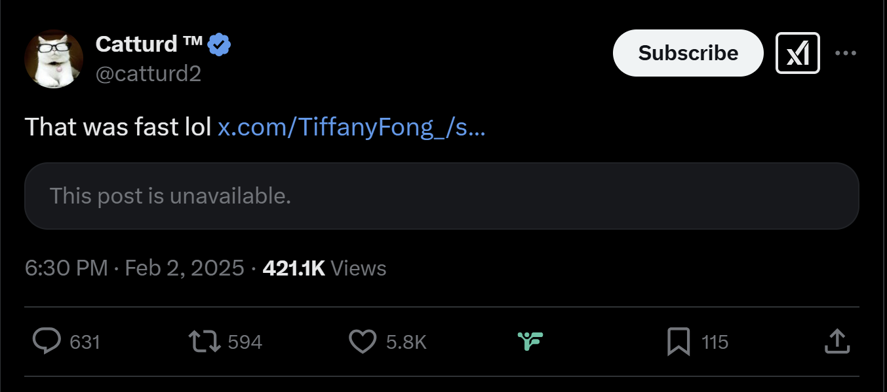
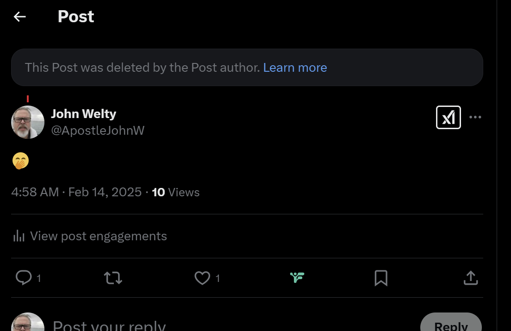
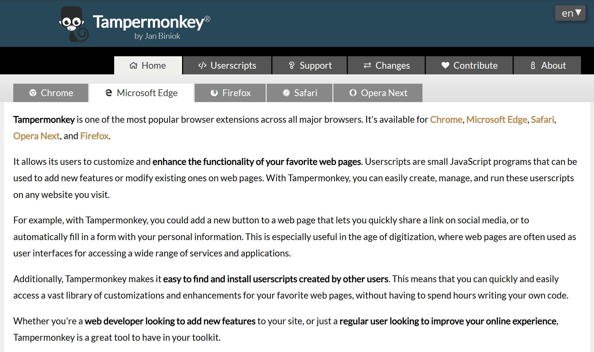
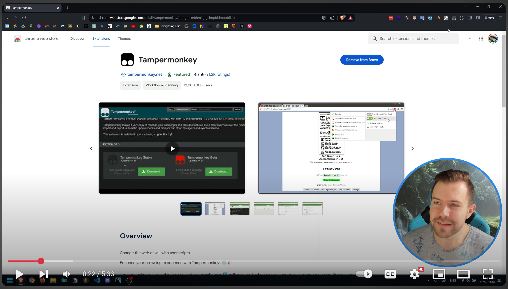
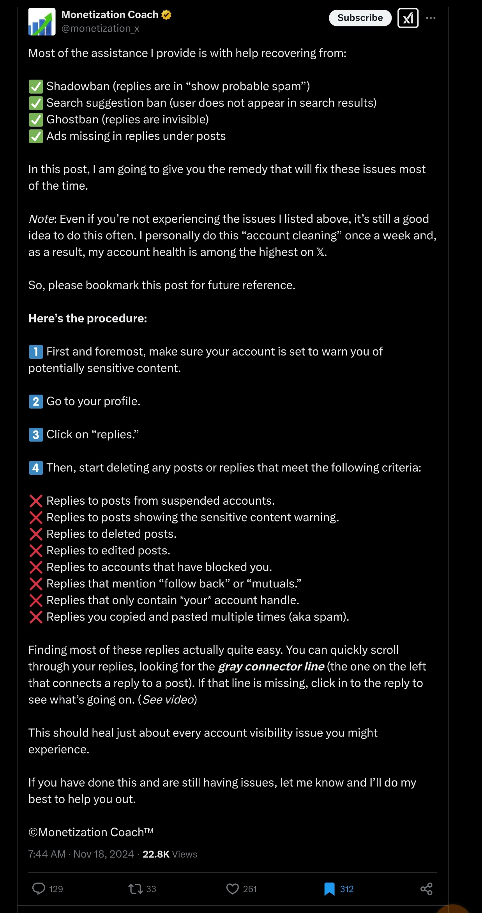
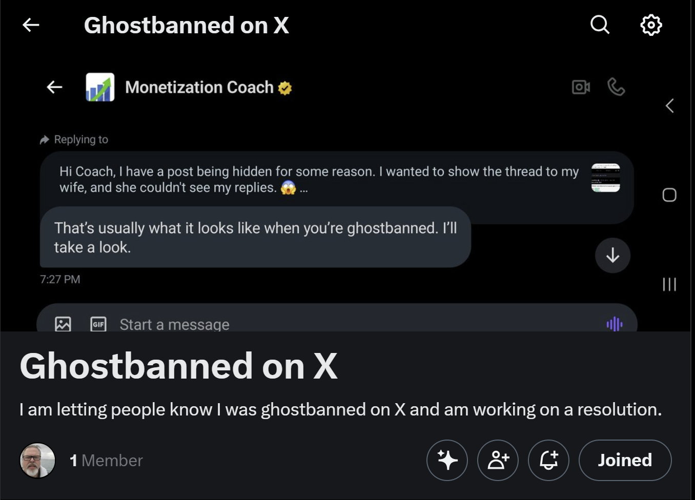

= 𝕏 Ghostban Prevention or Cleanup
:toc:

Working on a tool to make it easier to find "Hanging Chads" in replies to deleted posts or suspended accounts. The idea is to help find situations like these to avoid being ghostbanned or somtimes known as being shadowbanned on X.

== Examples

=== Quoted Post Now Unavailable

=== Replied to Post Before Author Deleted 

=== Reply Deleted by Author After You Replied

== This is for use within the https://www.tampermonkey.net[Tampermonkey] browser extension.

[link=https://www.tampermonkey.net]

=== Video for using Tampermonkey

[link=https://youtu.be/7LWOBkKhbGk?si=B8OXS99yR7Ln939V]

https://youtu.be/7LWOBkKhbGk?si=B8OXS99yR7Ln939V[Link to YouTube Tutorial]

== Message from Monetization Coach on 𝕏

[link=https://x.com/monetization_x/status/1858506676208382325]

https://x.com/monetization_x/status/1858506676208382325[Link to post]

== Join the 𝕏 Community to get updates

[link=https://x.com/i/communities/1891057939835666756]

https://x.com/i/communities/1891057939835666756[Link to community]

== Definitions from Grok 2

"Shadowban" and "ghostban" are terms often used interchangeably, but they refer to similar concepts within the realm of social media moderation:

- Shadowbanning typically refers to the act of blocking or partially blocking a user's content from other users without the user's knowledge. This could mean their posts do not appear in search results, on hashtag pages, or in the feeds of others, even though to the user, it looks like their content is being posted normally.

- Ghostbanning is a less commonly used term but essentially describes a similar action. The key difference, if any, might be in how it's implemented or perceived by different platforms or communities. Sometimes, ghostbanning might be considered more temporary or specific to certain actions or types of content.

Here's how they might be distinguished in some contexts:

* {empty}
Visibility:: Both reduce visibility, but shadowbanning might imply a broader suppression across the platform, while ghostbanning could be more about specific interactions or posts.
* {empty}
Detection:: Shadowbanning is notorious for being hard to detect by the banned user, whereas ghostbanning might be slightly more noticeable, especially if it's applied in a more targeted manner.
* {empty}
Purpose:: Both serve to moderate content without outright banning the user, but shadowbanning could be more about algorithmic filtering, while ghostbanning might be seen as a manual or semi-manual moderation technique.

In practice, these terms are used so similarly that for most intents and purposes, they describe the same phenomenon. The exact implementation can vary by platform:

* {empty}
On Twitter (X):: Shadowbanning is often discussed, where accounts might not show up in search or their tweets might not appear in trending topics.
* {empty}
On Reddit:: Ghostbanning might refer to when comments or posts are visible to the user who made them but not to others.

In summary, while there might be slight nuances in how people or platforms use these terms, shadowbanning and ghostbanning are generally regarded as the same action with different names, aimed at content moderation without the user's explicit awareness.

Source: https://x.com/i/grok/share/mufaVpmILrU6ebeGQsDzddEnd[Grok from xAI]
